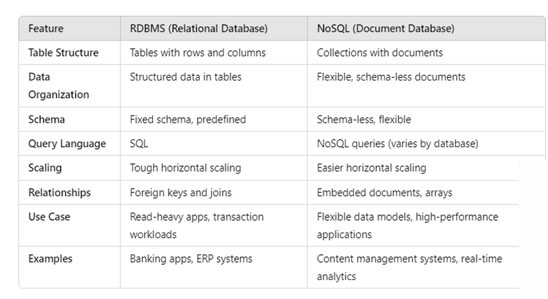

# Databases — SQL & NoSQL (Complete Markdown Notes)

---

# 🗄️ 1. What Is a Database?

> A database is an **organized collection of data** managed by a **Database Management System (DBMS)**.  
> The combination of database + DBMS + applications = **Database System**.

### Key points:

- DBMS interacts with users, applications, and the data itself.
- DBMS handles operations like storing, retrieving, updating, and securing the data.
- The term "database" is often used loosely for:
  - the DBMS
  - the database system
  - or even the application using it

---

# 📚 2. Types of Databases

## **1. Relational Databases (SQL)**

Examples: **MySQL, PostgreSQL**

- Store data in **tables (rows & columns)**
- Predefined **schemas**
- Ensure **ACID** (Atomicity, Consistency, Isolation, Durability)
- Ideal for structured data & complex queries

---

## **2. NoSQL Databases**

Example: **MongoDB**

- Stores data in **JSON-like documents**
- Schema-flexible
- Scalable & suited for large datasets
- Great for web apps

---

## **3. In-Memory Database**

Example: **Redis**

- Data stored in memory → ultra fast
- Good for caching, session storage, pub/sub

---

## **4. Distributed SQL Database**

Example: **CockroachDB**

- Horizontally scalable SQL database
- Strong consistency + global availability

---

## **5. Time Series Database**

Example: **InfluxDB**

- Designed for **time-stamped** data
- Used in IoT, monitoring, analytics

---

## **6. Object-Oriented Database**

Example: **db4o**

- Stores objects directly
- Matches object-oriented programming

---

## **7. Graph Database**

Example: **Neo4j**

- Data stored as **nodes + relationships**
- Ideal for social networks, fraud detection

---

## **8. Hierarchical Database**

Example: **IBM IMS**

- Parent–child tree structure
- Used in legacy, high-speed systems

---

## **9. Network Database**

Example: **IDMS**

- Graph-like structure with complex relationships
- Used in old enterprise systems

---

## **10. Cloud Database**

Example: **Amazon RDS**

- Managed relational database service
- Supports MySQL, PostgreSQL, Oracle
- Automatic backups, patches, scaling

---

# ⭐ Most Commonly Used Today:

1. **Relational (SQL)**
2. **NoSQL**

---

# 🧮 3. RDBMS (MySQL, PostgreSQL)

### EF Codd & Codd’s 12 Rules

- EF Codd defined the foundation of relational databases
- 13 rules (numbered 0–12)
- Used to determine what qualifies as a relational database

### MySQL Story

- Created by Michael Widenius
- Named after daughter **My**
- Forks: MaxDB, MariaDB (named after other daughters)
- Later acquired by Oracle

### PostgreSQL Story

- Started as **Ingres** project
- Evolved into **Post-Ingres → PostgreSQL**
- Uses SQL, powerful querying & extensibility

---

# 📝 4. NoSQL & MongoDB

### NoSQL Types:

1. Document Databases
2. Key-Value Stores
3. Graph Databases
4. Wide-Column Stores
5. Multi-Model Databases

### MongoDB specifics:

- Created in 2009 by 10gen
- “Mongo” = **humongous**
- Works great with JavaScript due to JSON structure

---

# ⚔️ 5. SQL vs NoSQL

### **Structure**

- SQL → tables, rows, columns
- NoSQL → collections, documents

### **Schema**

- SQL → fixed schema
- NoSQL → schema-less

### **Data Modeling**

- SQL → normalized tables, joins
- NoSQL → embedded documents

### **Scaling**

- SQL → vertical scaling
- NoSQL → horizontal scaling

### **Relationships**

- SQL → foreign keys, joins
- NoSQL → nested fields or references

### **Use Cases**

- SQL → banking, ERP, transactions
- NoSQL → content systems, analytics, real-time apps

---

# 🖼️ SQL vs NoSQL Diagram

---

# 📘 Summary Table

| Feature   | SQL (Relational)          | NoSQL (Document)           |
| --------- | ------------------------- | -------------------------- |
| Structure | Tables                    | JSON-like documents        |
| Schema    | Fixed                     | Flexible                   |
| Scaling   | Hard horizontal           | Easy horizontal            |
| Query     | SQL                       | Varies (Mongo query, etc.) |
| Best For  | Transactions, consistency | Scalability, flexibility   |

---
